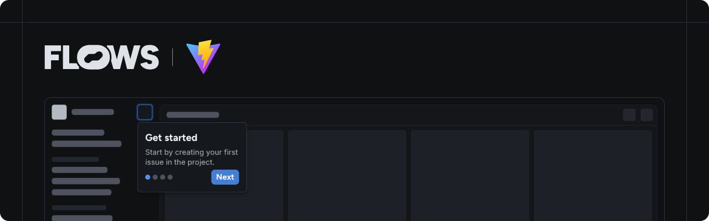

# Flows React Vite example

An example project showcasing how to use Flows with React and Vite to build native product growth experiences.

This example extends the Vite `react-ts` template with the [`@flows/react`](https://www.npmjs.com/package/@flows/react) and [`@flows/react-components`](https://www.npmjs.com/package/@flows/react-components) packages to demonstrate how to integrate Flows into your application.

## Features

### Flows provider

The `<FlowsProvider>` component sets up the Flows context for your application. See [`App.tsx`](./src/App.tsx) for an example implementation.

### Pre-built components

The `@flows/react-components` package includes ready-to-use components to build in-app experiences. Refer to [`App.tsx`](./src/App.tsx) to learn how to import and use these components.

### Custom components

Extend Flows by creating your own components for workflows and tours:

- **Workflow block:** The [`banner.tsx`](./src/components/banner.tsx) file demonstrates a custom `Banner` component with `title`, `body`, and an `close` prop connected to an exit node.
- **Tour block:** The [`tour-banner.tsx`](./src/components/tour-banner.tsx) file shows how to build a `TourBanner` component. It accepts `title` and `body` props, as well as `continue`, `previous` and `cancel` for navigation between tour steps.

For detailed instructions on building custom components, see the [custom components documentation](https://flows.sh/docs/blocks/create-custom-components).

### Flows slots

The `<FlowsSlot>` component lets you render Flows UI elements dynamically within your application. You can add placeholder UI for empty states. See [`App.tsx`](./src/App.tsx) for an example.

## Documentation

Learn more about Flows and how to use its features in the [official Flows documentation](https://docs.flows.sh/).
